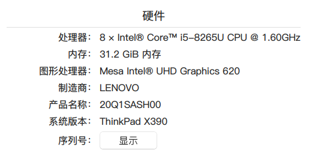
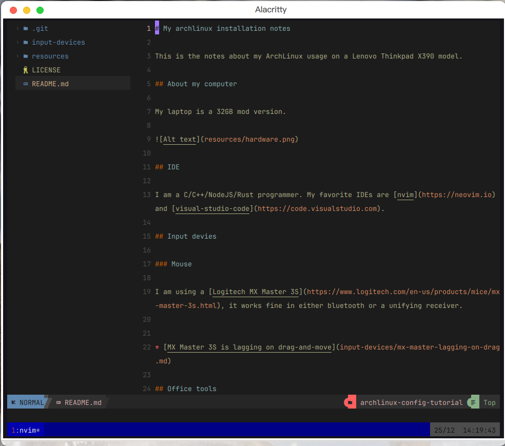

# My archlinux installation notes

This is the notes about my ArchLinux usage on a Lenovo Thinkpad X390 model.

## About my computer

My laptop is a 32GB mod version.

## IDE 

I am a C/C++/NodeJS/Rust programmer. My favorite IDEs are [nvim](https://neovim.io) and [visual-studio-code](https://code.visualstudio.com).

### nvim

## Input devies

### Mouse

I am using a [Logitech MX Master 3S](https://www.logitech.com/en-us/products/mice/mx-master-3s.html), it works fine in either bluetooth or a unifying receiver. 

* [MX Master 3S is lagging on drag-and-move](input-devices/mx-master-lagging-on-drag.md)

## Office tools

## IM tools

